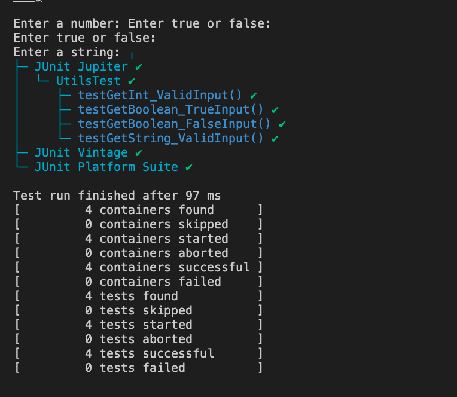

# 📘 Purpose of this File: SWE102 Assignment 3 - Write a Unit Test

## Java Vehicle Management Project with JUnit Tests

## 📂 Project Structure

```
Lab1_VehicleManagement/
├── src/
│   └── data/
│       ├── Utils.java
│       └── UsingMain.java
├── test/
│   └── data/
│       └── UtilsTest.java
└── lib/
    └── junit-platform-console-standalone-1.10.0.jar
└── bin/
└── .vscode/
```

## 🛠️ Compile and run test on VSCode IDE

Open the terminal on project folder and run:

```bash
# Create bin directory if not exists
mkdir -p bin

# Compile source and test files
javac -cp "lib/junit-platform-console-standalone-1.10.0.jar" -d bin src/data/*.java test/data/*.java
```

## 🧪 Step 3: Run the Tests

```bash
# Run JUnit Tests
java -cp "bin:lib/junit-platform-console-standalone-1.10.0.jar" org.junit.platform.console.ConsoleLauncher --scan-classpath --include-classname ".*UtilsTest"
```

## ✅ Example Output Image



---

**Support me with this assignment by merge this PR - Thank a lot! 🚀😊**
